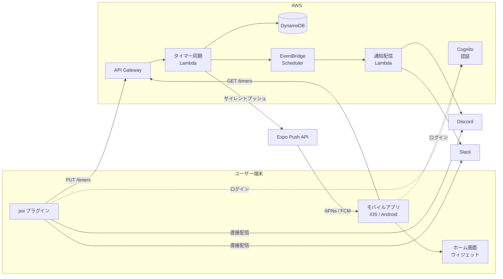
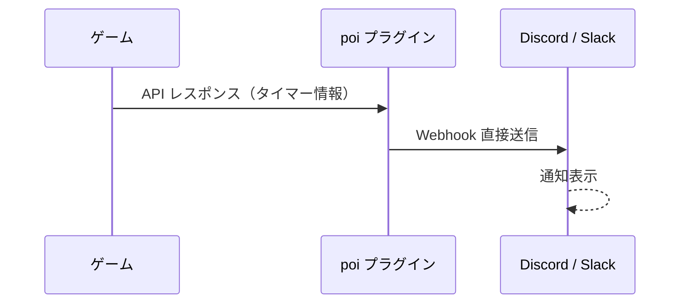
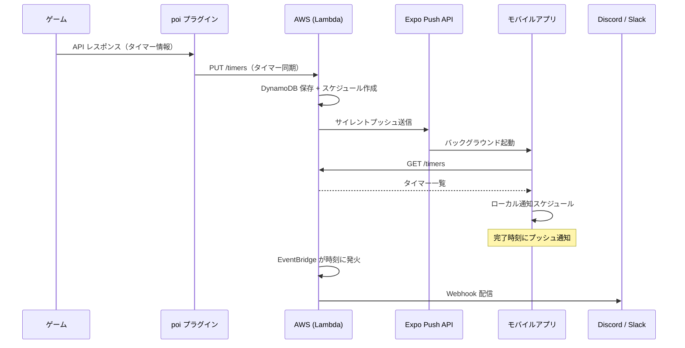

[](https://github.com/sponsors/Taikono-Himazin)


# poi-plugin-notice-webhook

[poi](https://github.com/poooi/poi) の遠征・入渠・建造完了通知を Discord / Slack へ転送するプラグインです。

## 特徴

- **直接配信モード** — poi が動作しているマシンから Webhook を直接送信
- **クラウド配信モード** — クラウドから通知。poi を閉じていても配信可能
- **モバイルアプリ** — iOS / Android 対応の専用アプリでスマートフォンにプッシュ通知
- Discord / Slack に対応

## クイックスタート

### 直接配信（設定不要）

1. poi にプラグインをインストール
2. 設定画面で「直接配信」を選択
3. Webhook URL を入力して保存

### クラウド配信

1. poi にプラグインをインストール
2. 設定画面で「クラウド経由」を選択
3. 「ログイン」ボタンからアカウントを作成してサインイン
4. Webhook URL を入力して保存

### モバイルアプリ

クラウド配信モードと連携し、スマートフォンへ直接プッシュ通知を送ります。Webhook の設定なしで利用できます。

1. iOS / Android アプリをインストール
2. poi プラグインと同じアカウントでログイン
3. タイマーが同期されると、完了時刻に自動でプッシュ通知が届きます

**Webhook URL の取得方法**

- **Discord** — チャンネル設定 →「連携サービス」→「ウェブフック」→「新しいウェブフック」で URL を作成（[公式ヘルプ](https://support.discord.com/hc/articles/228383668)）
- **Slack** — [Slack App](https://api.slack.com/apps) で Incoming Webhooks を有効化してチャンネルを選択（[公式ヘルプ](https://api.slack.com/messaging/webhooks)）

## アーキテクチャ



### 直接配信モード



### クラウド配信 + モバイルアプリ



## ディレクトリ構成

```
src/              poi プラグイン本体
mobile-app/       iOS / Android モバイルアプリ (React Native / Expo)
aws/
  lib/            CDK スタック定義
  src/            Lambda 関数
    account/        アカウント設定
    deliver/        通知配信
    ingest/         通知受信
    push-tokens/    プッシュトークン管理
    shared/         共通ロジック
    timers/         タイマー同期
    tokens/         トークン管理
scripts/          デプロイスクリプト
docs/             ドキュメント (GitHub Pages)
```

## アイコンについて

アイコン画像は pixiv で公開されている作品を使用しています。

- **出典:** [pixiv - 39534914](https://www.pixiv.net/artworks/39534914)

## ライセンス

MIT

---

## ⚓ サポート（リアル資材の補給）について

このプロジェクトを維持・発展させるために、提督の皆様からの温かい「補給」をお待ちしております。

### サーバーも、開発者も、燃料が必要です
このプラグインを安定して稼働させるために、裏側ではクラウド（AWS）のインスタンスたちが24時間365日、休むことなく遠征（データ処理）を繰り返しています。

ご存知の通り、クラウドの世界には　**「自然回復上限」**　という概念が存在しません。
動かせば動かすほど、リアルな資材（日本円）が溶けていく仕様となっております。

### 🍎 Apple税という名の「重い」壁
現在、iOS / Android 向けの **通知用モバイルアプリ** を公開しています。
iOS 版の維持には **Apple Developer Program（年額 $99）** が毎年必要です。

「個人の趣味で維持するには、この遠征費用はちょっと重い……（低速戦艦並みに）」

というのが開発者の正直な本音です。皆様の温かい支援が、App Store での公開を継続する力になります。

### 🎁 皆様のお気持ち
特定の支援プランは用意しておりません。
「このツールのおかげで通知が捗った」「開発者にコーヒー一杯分くらい奢ってやってもいい」という奇特な提督がいらっしゃいましたら、ぜひ下記リンクより **「お気持ち」** をいただけますと幸いです。

[](https://github.com/sponsors/Taikono-Himazin)

* **公平性:** このプラグインは**完全無料・オープンソース**です。支援の有無によって機能に差が出ることはありません。
* **用途:** 頂いたサポートは全額、AWSのインスタンス維持費および、iOSアプリ公開のための軍資金（Apple税）として大切に活用させていただきます。

**皆様の「補給」が、このプロジェクトの制空権を維持する力になります！**
