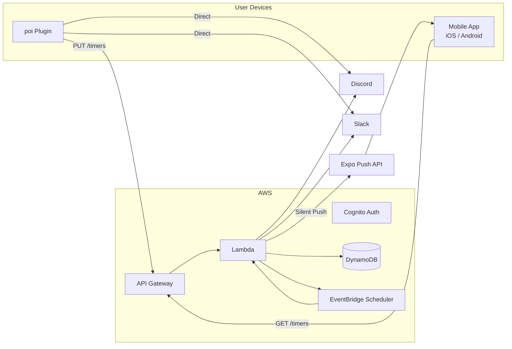

[日本語](../) \| [中文](../zh/)

# Notification Forwarder (poi Plugin)

A Webhook notification plugin for [poi](https://github.com/poooi/poi). Sends Discord / Slack notifications for game events such as expedition completion, repair completion, and construction completion.

## Features

- **Direct mode** — Send Webhooks directly from the machine running poi (no setup required)
- **Cloud mode** — Cloud-based notifications. Delivered even when poi is closed
- **Mobile app** — iOS / Android app with push notifications to your smartphone
- Supports Discord and Slack

## Quick Start

### Direct Mode (no setup required)

1. Install the plugin in poi
2. Select "Direct" in the settings
3. Enter your Webhook URL and save

### Cloud Mode

1. Install the plugin in poi
2. Select "Via Cloud" in the settings
3. Click "Login" to create an account and sign in
4. Enter your Webhook URL and save

### Mobile App

Push notifications directly to your smartphone — works with Cloud mode. No Webhook setup required.

1. Install the iOS / Android app
2. Sign in with the same account as your poi plugin
3. Timers sync automatically and push notifications are delivered at completion time

**How to get a Webhook URL**

- **Discord** — Channel Settings → Integrations → Webhooks → New Webhook ([Official Help](https://support.discord.com/hc/articles/228383668))
- **Slack** — Create a [Slack App](https://api.slack.com/apps) and enable Incoming Webhooks ([Official Help](https://api.slack.com/messaging/webhooks))

## Architecture

## Notification Events

| Event | Timing |
|---|---|
| Expedition complete | At completion (or just before) |
| Repair complete | At completion (or just before) |
| Construction complete | At completion (or just before) |

## Source Code

[GitHub Repository](https://github.com/Taikono-Himazin/poi-plugin-notice-webhook) — MIT License
