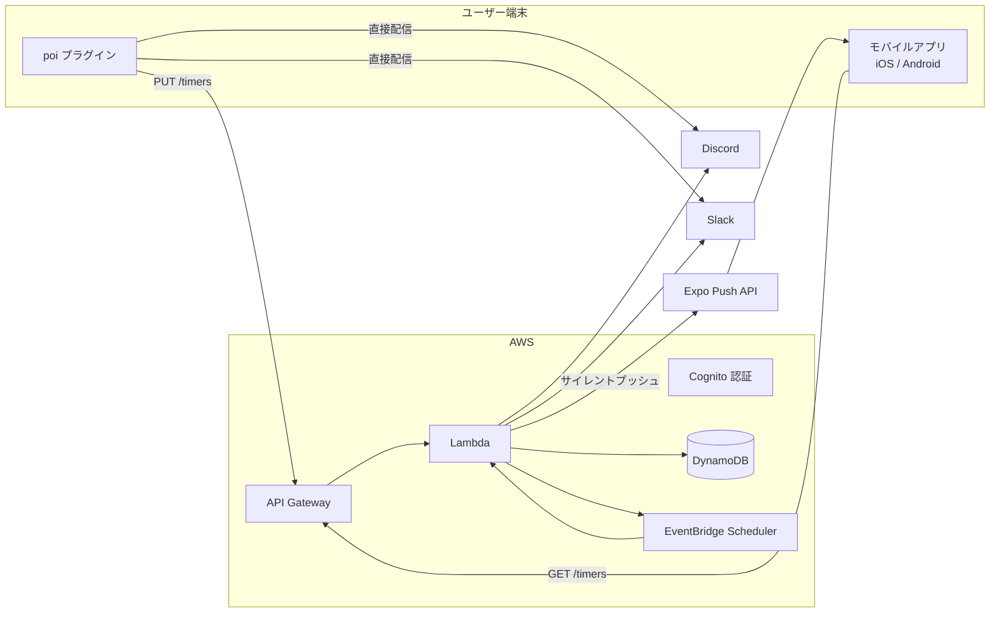

[English](en/) \| [中文](zh/)

# 通知転送（poiプラグイン）

[poi](https://github.com/poooi/poi) 向け Webhook 通知プラグインです。遠征完了・入渠完了・建造完了などのゲームイベントを Discord / Slack へ通知します。

## 特徴

- **直接配信モード** — poi が動作しているマシンから Webhook を直接送信
- **クラウド配信モード** — クラウドから通知。poi を閉じていても配信可能
- **モバイルアプリ** — iOS / Android 対応。スマートフォンへプッシュ通知でお知らせ
- Discord / Slack に対応

## クイックスタート

### 直接配信（設定不要）

1. poi にプラグインをインストール
2. 設定画面で「直接配信」を選択
3. Webhook URL を入力して保存(Webhook URLの取得方法は下を参照)

### クラウド配信

1. poi にプラグインをインストール
2. 設定画面で「クラウド経由」を選択
3. 「ログイン」ボタンからアカウントを作成してサインイン
4. Webhook URL を入力して保存(Webhook URLの取得方法は下を参照)

### モバイルアプリ

クラウド配信モードと連携し、スマートフォンへ直接プッシュ通知を送ります。Webhook の設定なしで利用できます。

1. iOS / Android アプリをインストール
2. poi と同じアカウントでログイン
3. poi プラグインでタイマーが同期されると、自動でプッシュ通知がスケジュールされます

**Webhook URL の取得方法**

- **Discord** — チャンネル設定 →「連携サービス」→「ウェブフック」→「新しいウェブフック」で URL を作成（[公式ヘルプ](https://support.discord.com/hc/articles/228383668)）
- **Slack** — [Slack App](https://api.slack.com/apps) で Incoming Webhooks を有効化してチャンネルを選択（[公式ヘルプ](https://api.slack.com/messaging/webhooks)）

## アーキテクチャ

## 通知内容

| イベント | タイミング |
|---|---|
| 遠征完了 | 完了時（または直前） |
| 入渠完了 | 完了時（または直前） |
| 建造完了 | 完了時（または直前） |

## ソースコード

[GitHub リポジトリ](https://github.com/Taikono-Himazin/poi-plugin-notice-webhook) — MIT License

---

<small>[プライバシーポリシー](privacy) / [利用規約](terms) </small>
