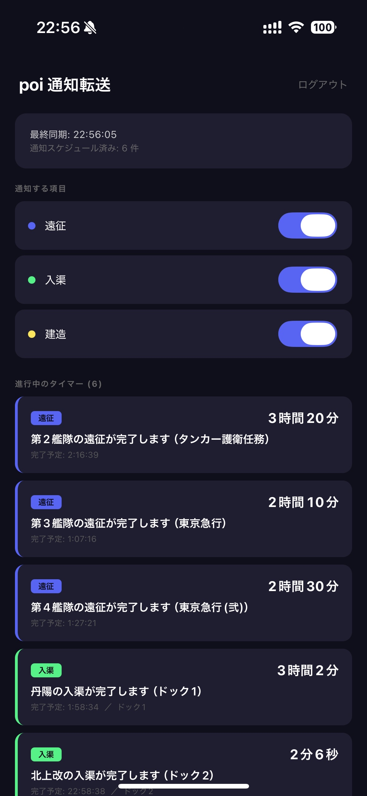

[English](en/mobile-app) \| [中文](zh/mobile-app)

# モバイルアプリ

iOS / Android 向けの専用アプリです。クラウド配信モードと連携し、スマートフォンへ直接プッシュ通知を送ります。Discord や Slack の Webhook 設定は不要です。

{: width="300" }

---

## 機能一覧

| 機能 | 説明 |
|---|---|
| プッシュ通知 | 遠征・入渠・建造の完了時にローカル通知 |
| タイマー一覧 | ホーム画面でリアルタイムカウントダウン表示 |
| 通知設定 | イベント種類ごとにオン・オフ切り替え |
| バックグラウンド同期 | 15分間隔の自動同期 + サイレントプッシュによる即時同期 |
| ホーム画面ウィジェット | Small / Medium / Large の 3 サイズ（iOS） |
| ロック画面ウィジェット | Inline / Circular / Rectangular の 3 種類（iOS 16+） |
| Sign in with Apple | Apple ID でワンタップログイン |

---

## 初回設定

1. アプリをインストール
2. poi プラグインと同じアカウント（メール / Google / Apple）でログイン
3. 通知の許可を求められたら「許可」を選択

ログイン後は自動で同期が開始されます。

---

## 仕組み

1. poi プラグインがゲームのタイマー（遠征・入渠・建造）をクラウドに同期
2. サーバがアプリへサイレントプッシュ通知を送信
3. アプリがバックグラウンドでタイマーを受信し、完了時刻に合わせてローカル通知をスケジュール
4. アプリを開いていなくても、完了時刻にプッシュ通知が届く

---

## 通知設定

アプリのホーム画面で、通知したいイベント種類を個別に切り替えできます。

| 種類 | アイコン | カラー | 説明 |
|---|---|---|---|
| 遠征 | ✈ `paperplane.fill` | 青紫 `#5865F2` | 遠征艦隊の帰投 |
| 入渠 | 🔧 `wrench.fill` | 緑 `#57F287` | ドック修理の完了 |
| 建造 | 🔨 `hammer.fill` | 黄 `#FEE75C` | 建造の完了 |

---

## ホーム画面ウィジェット（iOS）

アプリを開かずに遠征・入渠・建造の残り時間を確認できます。

### ウィジェットの追加方法

1. ホーム画面を長押し → 左上の「+」ボタン
2. 「poi通知転送」を検索
3. Small / Medium / Large を選んで追加

### サイズ別の表示内容

**Small（2x2）**

タイプ別セクションにプログレスバーと残り時間（HH:MM 形式）をコンパクトに表示します。スロット番号付きで全タイマーを一覧できます。

```
 ✈ 遠征
 2  ████████░░  00:32
 3  ██████░░░░  01:08
 4  █░░░░░░░░░  05:12
 🔧 入渠
 1  ████████░░  00:12
 2  ██████░░░░  00:45
 3  ███░░░░░░░  02:08
 4  █░░░░░░░░░  08:02
```

**Medium（4x2）**

タイプ別に列を分けた 2 段組レイアウト。遠征と入渠を左右に並べて一度に確認できます。

**Large（4x4）**

フルダッシュボード表示。全タイマーをタイプ別セクションで一覧し、メッセージ・プログレスバー・残り時間を表示します。最終同期時刻も確認できます。

---

## ロック画面ウィジェット（iOS 16+）

ロック画面に常時表示でき、アプリを開かずにタイマーを確認できます。

### ウィジェットの追加方法

1. ロック画面を長押し → 「カスタマイズ」
2. ウィジェットエリアをタップ
3. 「poi通知転送」を選択

### 種類

**accessoryInline**

日付の横に 1 行でアイコンと次のタイマーを表示します。

```
⚓ 入渠 00:12
```

**accessoryCircular**

円形のプログレスゲージで次のタイマーの進捗と残り時間を表示します。

**accessoryRectangular**

直近 3 件のタイマーをリニアゲージ付きで一覧表示します。

```
🔧 ██████████░░  00:12
✈  ████████░░░░  00:32
🔧 ██████░░░░░░  00:45
```

---

## 画面イメージ

ウィジェットの全サイズ・全パターンのデザインプレビューは以下で確認できます。

[ウィジェットデザインプレビュー（HTML）](widget-preview.html)

3 つのシナリオ（全タイマー / 一部 / 空）をタブで切り替え可能です。

---

## 技術仕様

| 項目 | 値 |
|---|---|
| フレームワーク | Expo 54 / React Native 0.81 |
| 対応 OS | iOS 17.0+ / Android |
| ウィジェット | SwiftUI WidgetKit（iOS のみ） |
| バックグラウンド同期 | expo-background-task（15分間隔） |
| 即時同期 | サイレントプッシュ通知 |
| 認証 | OAuth 2.0 + PKCE（Cognito） |
| データ共有 | App Groups（メインアプリ ↔ ウィジェット） |

### ウィジェットのデータフロー

```
poi プラグイン
  → API (PUT /timers)
    → Lambda → DynamoDB
      → サイレントプッシュ
        → アプリ (backgroundSync)
          → AsyncStorage (タイマーキャッシュ)
          → UserDefaults (App Groups)
            → WidgetKit (5分間隔で更新)
```
