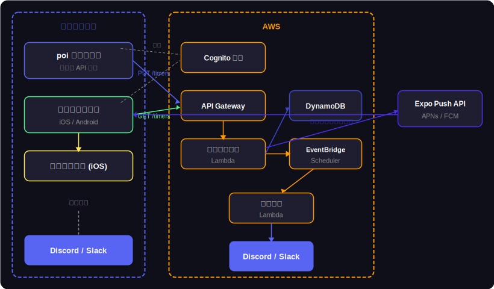

# 高度な使い方（セルフホスト向け）

> **通常利用の方はこのページは不要です。**
> プラグインをインストールして「クラウド経由」を選択するだけで利用できます。
>
> このガイドは自前の AWS 環境にデプロイしたい開発者・事業者向けです。

クラウド配信モードを自前の AWS 環境で動かすには以下のデプロイ手順が必要です。

## 必要なもの

- AWS アカウント
- AWS CLI（プロファイル設定済み）
- Node.js 20 以上

## 1. Google ログイン設定（任意）

Google アカウントでのサインインを有効にする場合：

1. [Google Cloud Console](https://console.cloud.google.com/) で OAuth 2.0 クライアントを作成
2. **承認済みリダイレクト URI** に Cognito のコールバック URL を追加
   - 形式: `https://poi-webhook-<AWS_ACCOUNT>.auth.<REGION>.amazoncognito.com/oauth2/idpresponse`
3. クライアント ID とシークレットをメモ

## 2. デプロイ

```bash
cd scripts
./deploy.sh --profile <AWS_PROFILE> --region ap-northeast-1
```

スクリプトが対話形式で以下を確認します。

| 変数                   | 説明                                          |
| ---------------------- | --------------------------------------------- |
| `GOOGLE_CLIENT_ID`     | Google OAuth クライアント ID（任意）          |
| `GOOGLE_CLIENT_SECRET` | Google OAuth クライアントシークレット（任意） |

入力した値は `aws/.poi-webhook-deploy.env` に保存されます（`.gitignore` 済み）。次回以降は Enter でスキップできます。

### オプション

```bash
./deploy.sh --profile myprofile --region ap-northeast-1 --skip-bootstrap
```

| オプション         | 説明                                               |
| ------------------ | -------------------------------------------------- |
| `--skip-bootstrap` | CDK bootstrap をスキップ（既に実行済みの場合）     |
| `--dry-run`        | デプロイせず CloudFormation テンプレートの確認のみ |

## 3. デプロイ後の確認

デプロイ完了後、以下の値が出力されます。これらは `src/aws-outputs.json` にも保存され、プラグインが自動読み込みします。

| 出力               | 説明                             |
| ------------------ | -------------------------------- |
| `ApiUrl`           | API Gateway のベース URL         |
| `UserPoolId`       | Cognito ユーザープール ID        |
| `UserPoolClientId` | Cognito クライアント ID          |
| `CognitoDomain`    | Cognito Managed Login のドメイン |

## 構成される AWS リソース



### エンドポイント一覧

| メソッド     | パス                | 説明                 | 認証     |
| ------------ | ------------------- | -------------------- | -------- |
| POST         | `/webhooks/{token}` | 通知受信             | トークン |
| PUT          | `/timers`           | タイマー同期         | Cognito  |
| GET          | `/timers`           | タイマー取得         | Cognito  |
| DELETE       | `/account`          | アカウント削除       | Cognito  |
| GET / PUT    | `/account/config`   | アカウント設定       | Cognito  |
| PUT / DELETE | `/push-tokens`      | プッシュトークン管理 | Cognito  |
| POST / GET   | `/tokens`           | トークン管理         | Cognito  |
| DELETE       | `/tokens/{token}`   | トークン削除         | Cognito  |
| POST         | `/errors`           | エラーレポート       | 不要     |
| GET          | `/errors`           | エラーログ一覧       | Cognito  |
| GET          | `/dashboard`        | エラーダッシュボード | 不要     |

### DynamoDB テーブル

| テーブル名                  | 用途                             |
| --------------------------- | -------------------------------- |
| `poi-webhook-accounts`      | ユーザーアカウント・Webhook 設定 |
| `poi-webhook-tokens`        | 通知用トークン                   |
| `poi-webhook-notifications` | 遅延配信キュー                   |
| `poi-webhook-timers`        | タイマー状態                     |
| `poi-webhook-push-tokens`   | モバイルプッシュトークン         |
| `poi-webhook-stats`         | 通知送信統計                     |
| `poi-webhook-errors`        | エラーログ                       |

## 再デプロイ

設定を変更した場合は同じコマンドで再デプロイできます。

```bash
cd scripts
./deploy.sh --profile <AWS_PROFILE> --region ap-northeast-1 --skip-bootstrap
```
