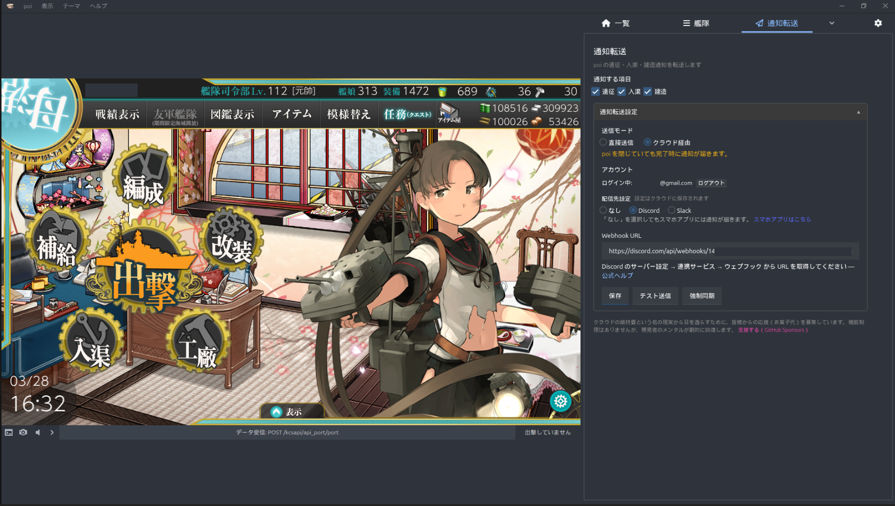
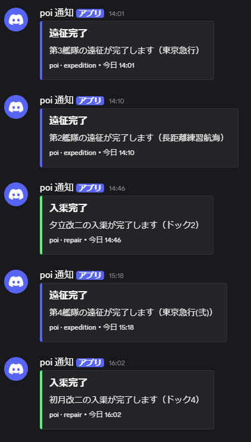

[日本語](../) \| [English](../en/)

# 通知转发（poi 插件）

适用于 [poi](https://github.com/poooi/poi) 的 Webhook 通知插件。将远征完成、入渠完成、建造完成等游戏事件通知到 Discord / Slack。

|               poi 插件               |                移动应用                 |           Discord 通知            |
| :----------------------------------: | :-------------------------------------: | :-------------------------------: |
|  |  |  |

## 特点

- **直接配送模式** — 从运行 poi 的机器直接发送 Webhook（无需设置）
- **云端配送模式** — 通过云端发送通知。即使关闭 poi 也能收到通知
- **移动应用** — iOS / Android 应用，通过推送通知直接发送到手机
- 支持 Discord 和 Slack

## 快速开始

### 直接配送模式（无需设置）

1. 在 poi 中安装插件
2. 在设置画面选择「直接配送」
3. 输入 Webhook URL 并保存

### 云端配送模式

1. 在 poi 中安装插件
2. 在设置画面选择「经由云端」
3. 点击「登录」按钮创建账户并登录
4. 输入 Webhook URL 并保存

### 移动应用

与云端配送模式联动，直接向手机发送推送通知。无需设置 Webhook。

1. 安装 iOS / Android 应用
2. 使用与 poi 插件相同的账户登录
3. 计时器自动同步，完成时自动推送通知

**获取 Webhook URL 的方法**

- **Discord** — 频道设置 → 集成 → Webhooks → 新建 Webhook（[官方帮助](https://support.discord.com/hc/articles/228383668)）
- **Slack** — 创建 [Slack App](https://api.slack.com/apps) 并启用 Incoming Webhooks（[官方帮助](https://api.slack.com/messaging/webhooks)）

## 架构

## 通知内容

| 事件     | 时机             |
| -------- | ---------------- |
| 远征完成 | 完成时（或之前） |
| 入渠完成 | 完成时（或之前） |
| 建造完成 | 完成时（或之前） |

## 源代码

## 目录

| 页面                | 说明                 |
| ------------------- | -------------------- |
| [使用方法](usage)   | 插件的设置和操作方法 |
| [API 参考](api)     | REST API 端点一览    |
| [隐私政策](privacy) | 个人信息处理方式     |
| [服务条款](terms)   | 服务使用条件         |

## 源代码

[GitHub 仓库](https://github.com/Taikono-Himazin/poi-plugin-notice-webhook) — MIT License
