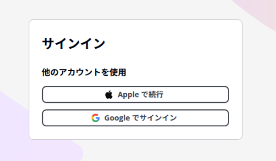

[日本語](../usage) \| [English](../en/usage)

# 使用方法

---

## 直接配送模式

从运行 poi 的机器直接发送 Webhook。无需额外设置。

### 设置步骤

1. 在 poi 设置画面打开插件
2. 在**配送方式**中选择「直接配送」
3. 选择 Webhook 类型（Discord / Slack）
4. 输入 **Webhook URL**
5. 点击「发送测试」验证连接
6. 点击「保存」

### 获取 Webhook URL 的方法

**Discord**

1. 打开要通知的频道设置
2. 集成 → Webhooks → 新建 Webhook
3. 复制 Webhook URL（格式：`https://discord.com/api/webhooks/...`）

[官方帮助](https://support.discord.com/hc/articles/228383668)

**Slack**

1. [创建 Slack App](https://api.slack.com/apps) 并启用 Incoming Webhooks
2. 选择频道并获取 Webhook URL（格式：`https://hooks.slack.com/services/...`）

[官方帮助](https://api.slack.com/messaging/webhooks)

---

## 云端配送模式

通过云端发送通知。即使关闭 poi 也能收到通知。

### 登录

1. 在**配送方式**中选择「云端配送」
2. 点击「登录」按钮
3. 使用邮箱地址创建账户或登录（也支持 Google 登录）

### Webhook 设置

登录后设置 Webhook 类型和 URL 并保存。设置保存在云端。

### 登出

点击「登出」按钮退出账户。登出时服务器端已计划的通知将被取消。

---

## 移动应用

iOS / Android 专用应用。与云端配送模式联动，直接向手机发送推送通知。无需设置 Discord 或 Slack 的 Webhook。

{: width="300" }

### 初始设置

1. 安装应用
2. 使用与 poi 插件相同的账户登录（邮箱 / Google / Apple）
3. 出现通知权限请求时选择「允许」

### 工作原理

- poi 插件将计时器同步到云端后，服务器向应用发送静默推送通知
- 应用在后台接收计时器数据，并在完成时间安排本地通知
- 即使应用未打开，也会在完成时收到推送通知

### 通知设置

在应用设置中，可以单独开关每种事件类型（远征 / 入渠 / 建造）的通知。

### 主屏幕小组件（iOS）

在主屏幕添加计时器小组件，无需打开应用即可查看剩余时间。

1. 长按主屏幕 → 点击左上角「+」按钮
2. 搜索「poi通知転送」
3. 选择 Small（1个计时器）或 Medium（最多3个）并添加

---

## 通知颜色

| 类型 | 事件 | Discord | Slack |
|---|---|---|---|
| `expedition` | 远征完成 | 紫蓝 `#5865F2` | 紫蓝 `#5865F2` |
| `repair` | 入渠完成 | 绿色 `#57F287` | 绿色 `#57F287` |
| `construction` | 建造完成 | 黄色 `#FEE75C` | 黄色 `#FEE75C` |
| `default` | 其他 | 灰色 `#AAAAAA` | 灰色 `#AAAAAA` |

---

## 测试通知

使用设置画面的「发送测试」按钮可以验证 Webhook 连接，无需等待实际游戏事件。
